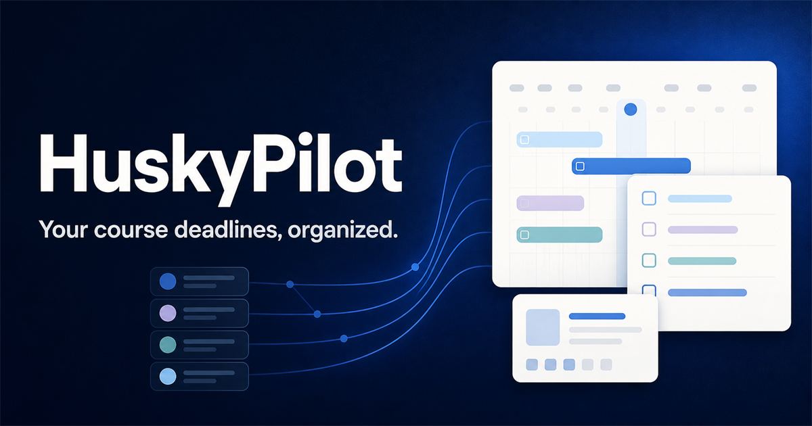
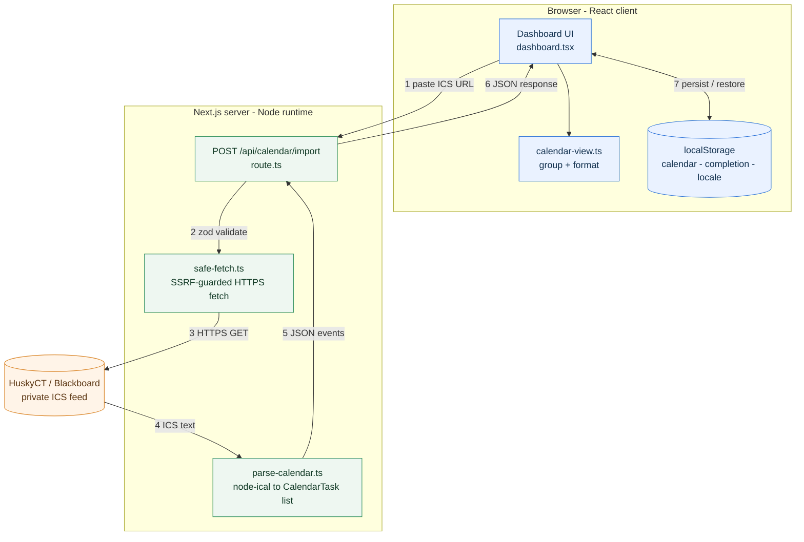

# HuskyPilot

**Your course deadlines, organized.** Paste a private HuskyCT / Blackboard ICS calendar link and get one calm, ordered view of what's due next.

**English** | [简体中文](./README.zh.md)

[**Live demo**](https://huskypilot.vercel.app/) · [Report an issue](https://github.com/NoGod3524/huskypilot/issues)

[](https://github.com/NoGod3524/huskypilot/actions/workflows/ci.yml)



## Why

UConn students track deadlines across HuskyCT (Blackboard), syllabi, and email. HuskyPilot turns the calendar feed you already have into a single rolling 7-day list, so "what's due next" is one glance instead of a scavenger hunt.

It is deliberately small and privacy-first: no NetID, no password, no scraping, no account.

## Features

- **Import any ICS feed** — paste your HuskyCT / Blackboard private calendar URL, with built-in help for finding it
- **Rolling 7-day view** — Today / Tomorrow / This week, grouped and time-sorted
- **Due-soon reminders** — an in-app banner for anything due in the next 24 hours, plus optional browser notifications while the app is open
- **Installable and offline** — add it to a phone's home screen as a PWA and keep reading saved tasks without a connection
- **Completion tracking** — tick tasks done; the state is saved in your browser and survives refresh
- **Workload insights** — completion rate, tasks per course, and the next 7 days / 4 weeks at a glance
- **English / 简体中文** — one-click language toggle, remembered across visits
- **Local persistence** — re-importing the same calendar preserves your completion state
- **Privacy by design** — your ICS URL is never stored; only parsed task fields live in your browser

## Architecture



### How an import works

1. You paste an ICS URL into the dashboard.
2. The client `POST`s it to `/api/calendar/import` (a Next.js route handler on the Node runtime).
3. The payload is validated with Zod (one `url` field, ≤ 2048 characters; request body ≤ 4 KB).
4. `safe-fetch.ts` validates and downloads the feed (see **Security** below).
5. `parse-calendar.ts` parses it with `node-ical`, expanding recurring events, handling all-day events, and extracting course codes from titles.
6. The route returns `{ calendarName, importedAt, events[] }` as JSON with `Cache-Control: no-store`.
7. The client groups events into Today / Tomorrow / This week and renders them. Completed task IDs and the language choice are kept in `localStorage`.

## Security: fetching a user-supplied URL safely

Downloading a URL that a user provides is a textbook SSRF surface, so the download path (`src/lib/safe-fetch.ts`) is intentionally strict:

| Control | What it does |
|---|---|
| HTTPS only | Rejects `http:`, URLs containing credentials, and any port other than 443 |
| DNS pre-resolution | Resolves every address and rejects private, loopback, link-local, multicast, and reserved ranges (IPv4 and IPv6) |
| Pinned connection | Connects to the **validated IP** while preserving the original `Host` header and TLS SNI, reducing DNS-rebinding risk |
| Bounded redirects | Follows at most 3 redirects, re-validating each hop |
| Size and time caps | Rejects responses over 2 MB (both declared and streamed) and times out after 8 seconds |
| Content check | Requires a `BEGIN:VCALENDAR` / `END:VCALENDAR` payload |

Failures are logged without ever writing the private calendar URL to the log.

## Privacy model

| Data | Where it lives |
|---|---|
| Your ICS URL | Nowhere — used once, never persisted |
| Parsed events | `localStorage`, in your browser only |
| Completed task IDs | `localStorage`, in your browser only |
| Language choice | `localStorage`, in your browser only |

No NetID, no password, no account, no database, no analytics. The **Clear saved data** button wipes the saved calendar and the completion state together.

## Tech stack

| Layer | Choice |
|---|---|
| Framework | Next.js 16 (App Router) |
| Language | TypeScript, with native type-stripping for tests |
| UI | React 19, Tailwind CSS 4, lucide-react |
| Calendar parsing | node-ical |
| Validation | Zod |
| Tests | Node's built-in test runner (`node --test`) |
| Hosting | Vercel |

## Project structure

```text
src/
├─ app/
│  ├─ api/calendar/import/route.ts   # POST endpoint: validate -> fetch -> parse -> JSON
│  ├─ layout.tsx                     # Metadata, theme setup, service worker registration
│  ├─ manifest.ts                    # Web app manifest (installable PWA)
│  ├─ page.tsx                       # Entry point
│  ├─ globals.css
│  └─ icon.tsx
├─ components/
│  ├─ dashboard.tsx                  # Import form, task cards, completion, reminders, language UI
│  └─ service-worker-registrar.tsx   # Registers the offline service worker (production only)
└─ lib/
   ├─ safe-fetch.ts                  # SSRF-hardened HTTPS download
   ├─ parse-calendar.ts              # ICS parsing -> CalendarTask[]
   ├─ calendar-view.ts               # Grouping (Today / Tomorrow / This week) and formatting
   ├─ calendar-types.ts              # Shared types
   ├─ date-utils.ts                  # Shared local-date helpers
   ├─ insights.ts                    # Workload analytics (completion, per course, per week)
   ├─ reminders.ts                   # Due-soon detection and reminder settings
   ├─ import-storage.ts              # Versioned localStorage for imported events
   ├─ completion-storage.ts          # Versioned localStorage for completed task IDs
   └─ i18n.ts                        # English / 简体中文 dictionaries and lookup
public/
├─ sw.js                             # Offline app-shell service worker
└─ icons/                            # PWA icons (192 / 512 / maskable)
tests/                               # node:test suites
```

## Getting started

Requires **Node.js 22+** (the test script relies on native TypeScript type stripping).

```bash
npm install
npm run dev      # http://localhost:3000
npm test         # parsing, grouping, URL blocking, storage
npm run lint
npm run build
```

## Design decisions

- **Fetch on the server, not in the browser.** Calendar hosts rarely send permissive CORS headers, and keeping the download in one module (`safe-fetch.ts`) makes the SSRF controls reviewable in a single place.
- **Never store the ICS URL.** The feed URL embeds a private token. Persisting it would enable background sync, but it would break the privacy promise — so manual re-import is the deliberate trade-off.
- **Version every stored payload.** Each `localStorage` entry is a versioned, structurally validated object. Malformed data is dropped (and the user is told) instead of crashing the app.
- **Completion is keyed by event ID.** IDs are derived from the event UID plus start time, so re-importing the same calendar preserves completion. If the source calendar moves an event's start time, its ID changes and completion resets — a known limitation.
- **A rolling 7 days, not a calendar week.** The question the app answers is "what's due next", not "what is on this week's grid".
- **No i18n library.** The string set is bounded and small; two dictionaries plus a lookup function were enough.
- **Reminders only fire while the app is open.** Real background push would need a push server plus stored subscriptions, which this project deliberately avoids. So reminders are an in-app banner plus opt-in notifications, de-duplicated by a task fingerprint so the same reminder is never repeated.
- **Offline means the app shell, not the data.** The service worker serves navigations network-first (so a new deploy lands immediately) and hashed assets cache-first, and never caches the import API. The tasks themselves already live in `localStorage`.

## Testing

`npm test` runs the `node:test` suite using Node's native TypeScript type stripping — no bundler or test framework needed. Coverage includes ICS parsing (recurring events, all-day events, course extraction), grouping, URL / SSRF rejection, and the versioned import and completion storage modules.

## Background

HuskyPilot started as a personal tool. Deadlines were spread across HuskyCT, syllabi, and email, and the existing options either asked for a NetID or wanted more access than a simple "what's due next" view needs. This project is a narrow attempt to fix that: one private calendar feed in, one clear list out, and everything kept on your own device.

## Roadmap

- [x] CI: run `test` / `lint` / `build` on every pull request
- [x] Insights view: workload by course, busiest weeks, completion rate
- [x] Installable PWA with an offline app shell
- [x] Due-soon reminders (while the app is open)
- [ ] Optional, opt-in auto-refresh (would require storing the feed URL locally)
- [ ] Background push reminders (would require a push server)
- [ ] Export tasks to CSV / JSON

## Author

Built by [Yinuo (NoGod3524)](https://github.com/NoGod3524), a UConn student.
